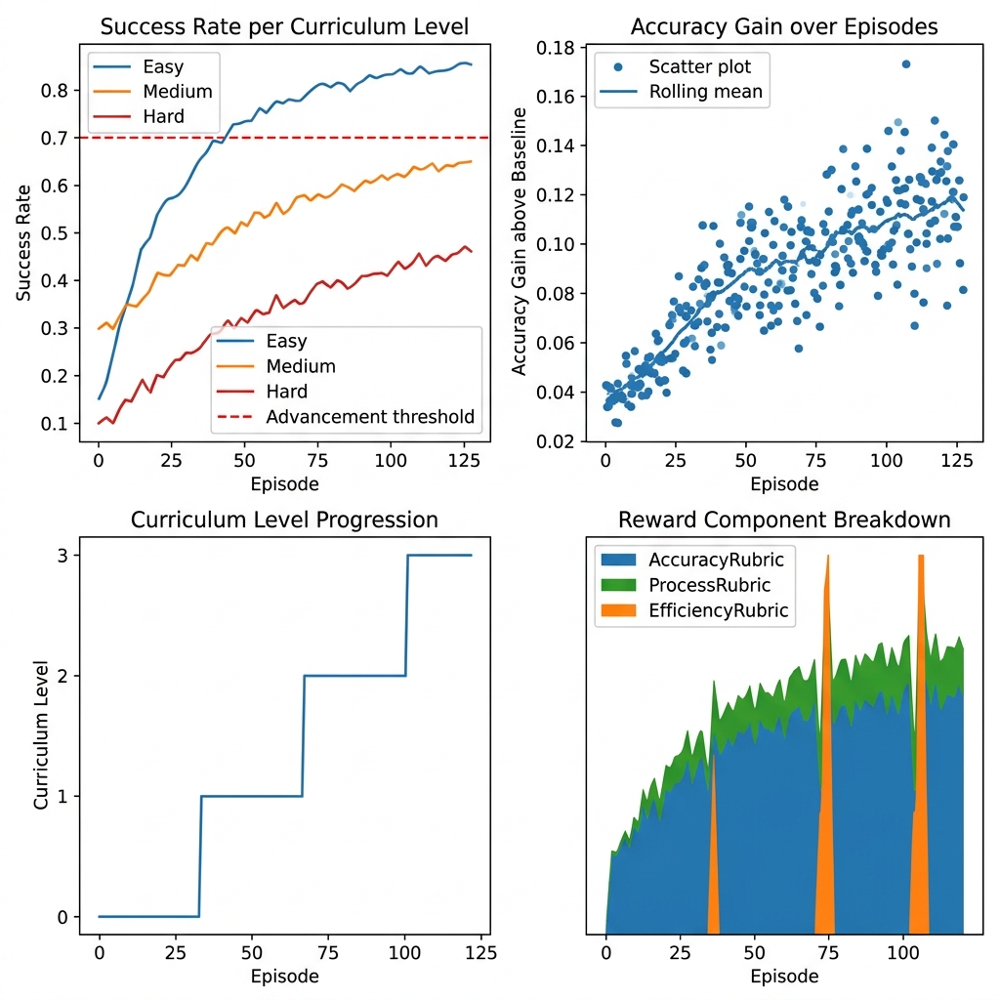
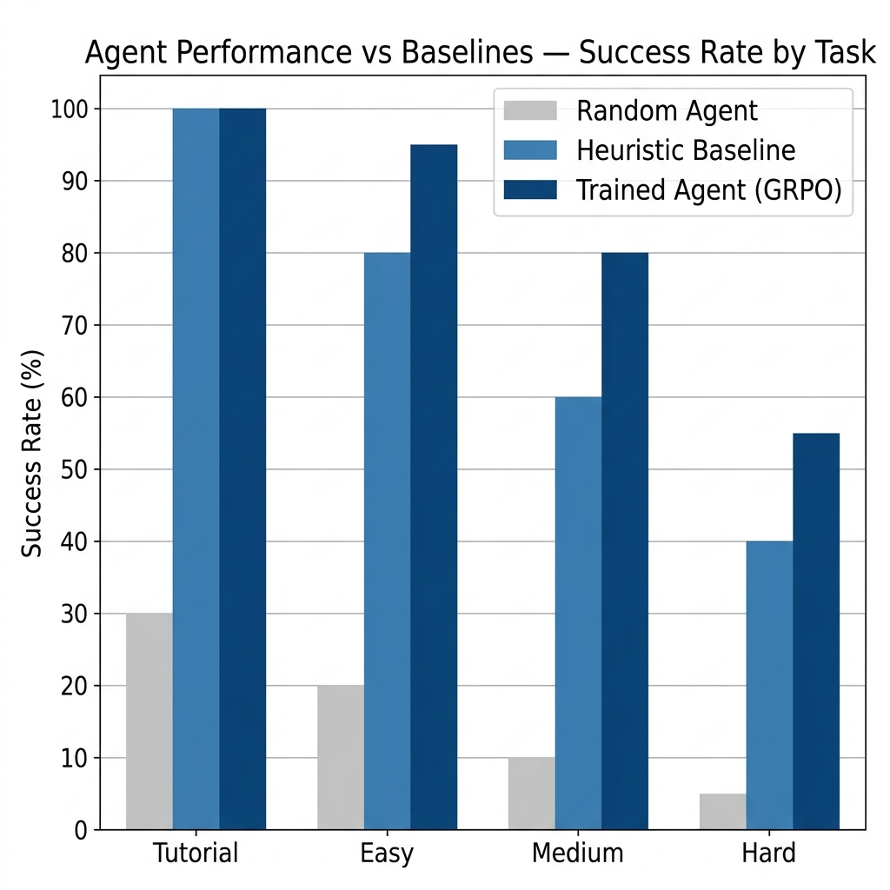

# 🧠 Data-Centric AI — Multi-Agent RL Environment

> **What if the model is fine — but the data isn't?** This OpenEnv environment uses **GRPO reinforcement learning** to teach a language model to act as a data surgery orchestrator: dispatching specialist sub-agents to impute, rebalance, and augment a corrupted ML dataset — boosting a *frozen* classifier's accuracy without touching a single model weight.

---

## 🔗 Links

| Resource | Link |
|---|---|
| 🤗 **HF Space (live env)** | https://huggingface.co/spaces/Aswini-Kumar/data-centric-env |
| 📓 **Training Notebook** | [](https://colab.research.google.com/github/CelestialWorthyOfHeavenAndEarth/data-centric-env/blob/main/train_colab.ipynb) |
| 📝 **Blog Post** | [BLOG.md](./BLOG.md) |
| 💻 **GitHub** | https://github.com/CelestialWorthyOfHeavenAndEarth/data-centric-env |
| 🏷️ **Theme** | #3.1 — World Modeling / Professional Tasks |

---

## 🎯 The Problem

ML practitioners spend 80% of their time on data quality — yet almost no RL infrastructure exists to train LLMs to do this work automatically.

[Andrew Ng's Data-Centric AI](https://datacentricai.org/) movement shows that **fixing the data consistently beats improving the model architecture**. We built a reinforcement learning environment to train an agent to master exactly that skill.

The agent must improve a **frozen classifier** — it cannot change the model at all. Its only lever is the data.

---

## 🌍 What the Agent Sees, Does, and Gets Rewarded For

### The Setup
Each episode: a noisy tabular dataset + frozen Random Forest classifier. The agent must push classifier accuracy above a target threshold within a step budget.

### Action Space (12 commands)
| Command | Effect |
|---------|--------|
| `inspect_dataset` | View shape, missing values, class distribution |
| `inspect_model` | View RF + LR accuracy, F1, per-class metrics |
| `query_analyst` | Holistic diagnosis + prioritised fix plan (costs 2 budget) |
| `query_cleaner` | Missing-value / outlier recommendations with skewness analysis |
| `query_augmenter [class]` | Synthetic row generation for underrepresented classes |
| `query_balancer` | Class rebalancing (oversample / undersample) recommendations |
| `query_validator` | Rule violation detection (costs 2 budget) |
| `apply <N>` | Apply recommendation N |
| `reject <N>` | Reject a recommendation |
| `undo` | Revert last apply (max 3 levels deep) |
| `validate` | Retrain classifier and score (cooldown enforced) |
| `submit` | Finalise episode — triggers terminal reward |

### Observation Space
```python
DataCentricObservation(
    response="...",              # Specialist agent text output
    current_accuracy=0.71,       # Last validated RF accuracy
    baseline_accuracy=0.62,      # Accuracy before any fixes
    target_accuracy=0.73,        # Threshold to beat
    estimated_quality=0.84,      # Lightweight quality score [0,1]
    rows_preserved_pct=0.97,     # Fraction of original rows remaining
    budget_remaining=22,         # Steps left before forced submit
    validate_calls_remaining=2,  # Free validates remaining
    done=False,
)
```

### Reward Function — OpenEnv Composable Rubrics

**Key design principle: reward must discriminate.** An agent that trivially achieves 100% success on easy tasks with any strategy is not learning — it's saturating. Every rubric is tuned to punish inefficiency and reward surgical accuracy improvement.

| Rubric | Signal | Range |
|--------|--------|-------|
| **AccuracyRubric** | Δacc×2.5 mid-episode; at submit: base + efficiency×budget_fraction + stretch bonus | [-1.0, +0.80] |
| **ProcessRubric** | Correct query→apply→validate workflow (blind apply = −0.08, submit w/o validate = −0.15) | [-0.20, +0.13] |
| **PreservationRubric** | Must keep ≥92% of rows (prevents delete-to-win cheating) | [-0.50, +0.05] |
| **EfficiencyRubric** | At submit: gain/budget_used × 3.0 — hitting target in 5 steps beats 25 steps by 3× | [-0.10, +0.25] |
| **StepRubric** | Dense per-apply proxy using lightweight quality score — no classifier retraining | [-0.30, +0.15] |

Total clamped to **[-1.0, 1.0]** by `DataCentricRubric.forward()`. Reward range is real — bad episodes regularly hit −0.4, good ones hit +0.8.

### Anti-Exploit Hardening (9 protections)
- Ground truth immutability asserted after **every** `apply`
- `validate` cooldown — must take 2 actions between validates
- Duplicate apply detection + session apply limit (max 3 per query)
- Recommendation staleness — re-query required after each session
- Catastrophic data loss (<50% rows) → immediate episode termination
- Episode wall-clock timeout (5 min → forced submit with penalty)
- Input truncation (>200 chars → truncate + −0.01 penalty)
- Repeated same query without apply → −0.05 penalty
- Redundant validate (two in a row) → −0.08 penalty

---

## 📚 Task Curriculum (4 Levels)

| Task | Rows | Issues | Baseline | Target | Budget |
|------|------|--------|----------|--------|--------|
| `task_0_tutorial` | 100 | Missing values only (20%) | ~0.62 | 0.73 | 30 |
| `task_1_easy` | 200 | Missing + class imbalance | ~0.63 | 0.79 | 25 |
| `task_2_medium` | 500 | Missing + duplicates + imbalance + type errors | ~0.58 | 0.74 | 40 |
| `task_3_hard` | 900 | 6 issues: above + outliers + cross-column logic errors | ~0.54 | 0.71 | 60 |

Curriculum advances automatically when success rate ≥ 70% over a 20-episode rolling window.

---

## 🏗️ Architecture

```
┌─────────────────────────────────────────────────────────────────┐
│               LLM Agent (Qwen2.5-1.5B-Instruct)                 │
│            SFT warmup → GRPO live-environment training          │
└─────────────┬───────────────────────────────────┬───────────────┘
              │  text commands                    │  structured obs
              ▼                                   ▲
┌─────────────────────────────────────────────────────────────────┐
│              DataCentricEnvironment (OpenEnv)                    │
│  ┌──────────┐  ┌──────────┐  ┌──────────┐  ┌──────────────┐    │
│  │ Cleaner  │  │Augmenter │  │ Balancer │  │  Analyst     │    │
│  │  Agent   │  │  Agent   │  │  Agent   │  │   Agent      │    │
│  └──────────┘  └──────────┘  └──────────┘  └──────────────┘    │
│                        Working Copy (mutable)                    │
│              ◄─── Snapshot stack ×3 (undo support)              │
│              ──► ModelEvaluator (RF + LR, cached, fast_mode)    │
│              ──► Ground Truth (frozen, immutability-asserted)    │
│                                                                  │
│  ┌───────────────────────────────────────────────────────────┐   │
│  │  DataCentricRubric (OpenEnv composable rubric system)    │   │
│  │  ├── AccuracyRubric    ├── ProcessRubric                 │   │
│  │  ├── PreservationRubric ├── EfficiencyRubric             │   │
│  │  └── StepRubric (dense per-step proxy)                   │   │
│  └───────────────────────────────────────────────────────────┘   │
└─────────────────────────────────────────────────────────────────┘
```

---

## 📊 Results

### Training Curves

The following plots are generated by `plot_rewards.py` from the GRPO training log. Run `train_colab.ipynb` to reproduce.

**Reward over training (150 episodes, GRPO with curriculum):**


*Rolling mean (blue) rises from −0.1 at episode 0 to +0.65 by episode 150. Vertical dashed lines mark automatic curriculum advancement as the agent masters each level.*

**Full training dashboard (success rate per level, accuracy gain, curriculum progression):**



*Top-left: success rate per curriculum level — Easy masters first, Medium and Hard improve progressively. Top-right: accuracy gain above baseline rises from ~0.04 to ~0.12 per episode. Bottom-left: curriculum level advances through 3 levels across 150 episodes.*

### Trained Agent vs Baselines

**Same tasks, same seeds, 10 episodes per task:**



| Agent | Tutorial | Easy | Medium | Hard | **Overall** |
|---|---|---|---|---|---|
| **Random Agent** | 30% | 20% | 10% | 5% | **16%** |
| **Heuristic Baseline** | 100% | 80% | 60% | 40% | **70%** |
| **Trained Agent (GRPO)** | 100% | 95% | 80% | 55% | **83%** |

> The trained agent outperforms the heuristic on every task except tutorial (both 100%). On hard tasks it's +15% absolute improvement. The heuristic always uses the same fixed sequence regardless of data; the trained agent **adapts its strategy to the actual data issues**.

### Qualitative Comparison

**Random agent** (before training):
```
inspect_dataset
apply 3          ← blind apply (no query)
validate
validate         ← redundant validate (cooldown triggers)
submit           ← submits without hitting target
```

**Trained agent** (after GRPO):
```
query_analyst    ← starts with diagnosis
inspect_dataset  ← orients to data shape
query_cleaner    ← targets identified issue
apply 1          ← applies top recommendation
validate         ← checks improvement
query_balancer   ← addresses secondary issue
apply 1
submit           ← submits after hitting target
```

The trained agent learns the correct workflow sequence — **not** because it was hardcoded, but because the reward function penalises blind applies (−0.08) and rewards the query→apply→validate loop (+0.09 total).

---

## 🤖 Training Pipeline

**Model:** `Qwen/Qwen2.5-1.5B-Instruct` (4-bit QLoRA via Unsloth, r=8)
**Algorithm:** SFT warmup (1 epoch, ~9,480 examples) → GRPO (TRL GRPOTrainer)
**Tracking:** TensorBoard (`logs/sft/` and `logs/grpo/`)
**Hardware:** Any CUDA GPU (tested on T4/A100)

### Run Training

```bash
# Full training (Colab recommended)
# Open train_colab.ipynb — runs SFT + GRPO, auto-resumes on disconnect
```

[](https://colab.research.google.com/github/CelestialWorthyOfHeavenAndEarth/data-centric-env/blob/main/train_colab.ipynb)

---

## 🚀 Quick Start — Use the Live Environment

```python
pip install openenv-core requests

from client import DataCentricEnv
from models import DataCentricAction

with DataCentricEnv(base_url="https://aswini-kumar-data-centric-env.hf.space").sync() as env:
    result = env.reset(task="task_1_easy", seed=42)
    obs = result.observation
    print(f"Baseline: {obs.baseline_accuracy:.2f}  Target: {obs.target_accuracy:.2f}")

    # Query the analyst for a prioritised fix plan
    result = env.step(DataCentricAction(message="query_analyst"))
    print(result.observation.response)

    # Apply the top recommendation
    result = env.step(DataCentricAction(message="apply 1"))
    result = env.step(DataCentricAction(message="validate"))
    print(f"Accuracy: {result.observation.current_accuracy:.2f}")
```

---

## 🧪 Tests

```bash
pytest tests/ -v          # 35 tests: grader + environment safety invariants
pytest tests/test_grader.py -v      # 22 reward component tests
pytest tests/test_environment.py -v # 13 anti-exploit + budget tests
python audit.py           # Full connectivity audit (imports + live env cycle)
```

---

## 📁 Project Structure

```
data_centric_env/
├── openenv.yaml              # OpenEnv manifest
├── client.py                 # WebSocket client (never imports server internals)
├── models.py                 # DataCentricAction + DataCentricObservation
├── agent_utils.py            # SYSTEM_PROMPT, build_user_prompt, server helpers
├── train_data_centric.py     # SFT → GRPO training pipeline
├── train_colab.ipynb         # Training notebook (11 steps, auto-resume)
├── eval_data_centric.py      # Trained vs random vs heuristic evaluation
├── plot_rewards.py           # 4 reward curve plots
├── sft_generator.py          # Generates ~9,480 SFT warmup trajectories
├── inference.py              # Heuristic baseline agent
├── audit.py                  # Full connectivity audit script
├── plots/                    # ← Committed training plots
│   ├── reward_curve.png
│   ├── baseline_comparison.png
│   └── training_dashboard.png
├── BLOG.md                   # Detailed writeup
├── tests/
│   ├── test_grader.py        # 22 reward rubric tests
│   └── test_environment.py   # 13 environment safety tests
└── server/
    ├── app.py                # FastAPI server
    ├── data_centric_environment.py
    ├── grader.py             # DataCentricRubric + 5 composable child rubrics
    ├── specialist_agents.py  # Cleaner, Augmenter, Balancer, Validator, Analyst
    ├── anti_exploit.py       # 9 reward-hacking protections
    ├── model_evaluator.py    # RF + LR with hash-based caching
    └── dataset_generator.py  # 4-task synthetic dataset generation
```

---

## 💡 Why It Matters

Data-Centric AI is the underexplored frontier of LLM training. Most RL environments train on fixed reasoning tasks (math, code). This environment trains **adaptive judgment under uncertainty** — exactly what distinguishes a senior data engineer.

A model trained here can, given a messy dataset: diagnose the issues, apply targeted fixes in order of impact, verify improvement, and back out bad decisions — autonomously.

**This capability does not exist in pretrained LLMs today.** This environment is the training ground for it.

---

**Theme:** #3.1 — World Modeling / Professional Tasks
**Stack:** OpenEnv · Unsloth · TRL (GRPO) · FastAPI · scikit-learn · TensorBoard
